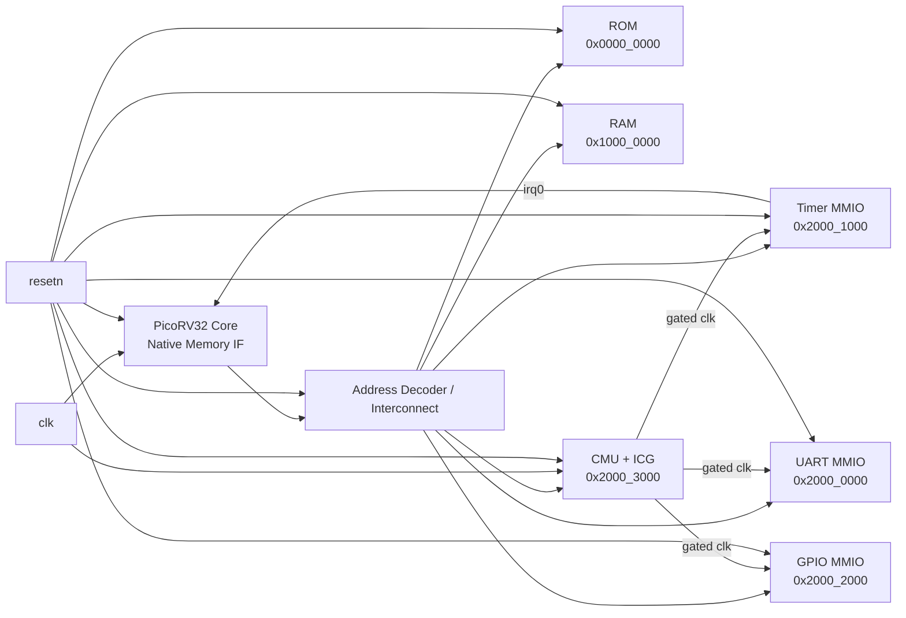

# SoC Block Diagram (Phase 2)

## Integration notes
- Native PicoRV32 memory interface is used for simpler student-friendly integration.
- CMU is always on root clock so clock gating control registers stay accessible.
- UART/Timer/GPIO run on gated clocks from CMU ICG outputs.
